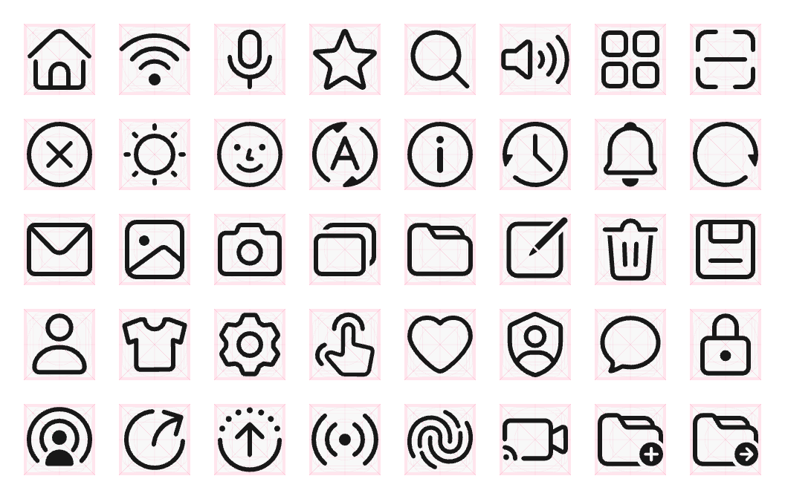

## HarmonyOS Symbol

[HarmonyOS Symbol](https://developer.huawei.com/consumer/cn/design/harmonyos-symbol/) 代表了 HarmonyOS 系统图标设计的一次重要演进。

它通过简化的图形和直观的语义表达，不仅易于识别，同时融入了更多年轻化的设计理念，使得整体的视觉风格更加年轻和时尚。

同时 HarmonyOS Symbol 还具备了字体属性，使其能够与系统字体无缝对接，确保了文本与图标的排版一致性。

此外，它能够根据文本的粗细变化进行智能适配，确保了在不同文本粗细下，图标能够灵活适应，保持视觉的连贯性和一致性。



## Usage

Use with the [Icon](https://api.flutter.dev/flutter/widgets/Icon-class.html) class to show specific icons.

Icons are identified by their name as listed below, e.g.

[HarmonySymbols.HarmonyOS_Next].

```dart
import 'package:hm_symbol/hm_symbol.dart';

Icon(HarmonySymbols.HarmonyOS);
```

## Design Guides

https://developer.huawei.com/consumer/cn/doc/design-guides/system-icons-0000001929854962
